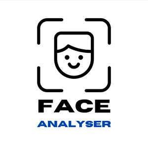

<div align="center">
<p align="center"></p>
</div>


## About The Project

This project studies the capabilities of a Machine Learning model on analysing facial features and classifying pictures of people by gender, age and race. For now, only the gender classifier is implemented, but I have plans to add the other two soon. The project is currently hosted by Streamlit's Cloud Service on this [website](https://face-analyser.streamlit.app).


The gender model's architecture is based on VGG-16 and it's convolutional layer weights were pre-trained on the imagenet dataset. The deep layers were trained on the UTKFace dataset, containing more than 20 thousand images of faces of people from, both male and female, with different ages and races.

If you wish to see  the different applications of the UTKFace dataset, you can check out [Papers With Code](https://paperswithcode.com/dataset/utkface).


## Installation


To run the project locally, follow these steps:

1. Clone the repo
   ```sh
   git clone https://github.com/gabriel-rch/FaceAnalyser.git
   ```
2. Install Python (3.11) dependencies.
   ```sh
   pip install -r requirements.txt
   ```
3. Run the Streamlit app
   ```sh
   streamlit run
   ```

## Usage

Upload a picture containing face(s) or use the avaliable samples to see the models in action!

If you wish to train your own models and use them on this demo, you can change the code on the `load_model` function to create a model with your architecture and load your weights into it! 


## Contributing

Any contributions you make are **greatly appreciated**.

If you have a suggestion that would make this better, please fork the repo and create a pull request. You can also simply open an issue with the tag "enhancement".
Don't forget to give the project a star! Thanks again!

1. Fork the Project
2. Create your Feature Branch (`git checkout -b feature/AmazingFeature`)
3. Commit your Changes (`git commit -m 'Add some AmazingFeature'`)
4. Push to the Branch (`git push origin feature/AmazingFeature`)
5. Open a Pull Request

## License

Distributed under the Apache 2.0 License. See `LICENSE` for more information.